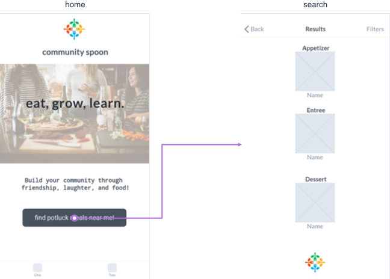
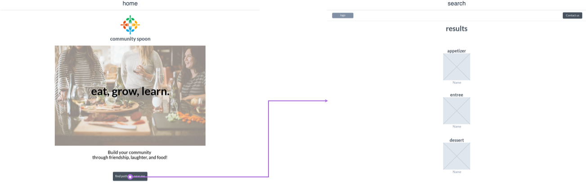
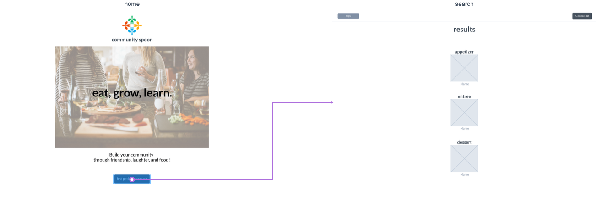

# community-spoon (site link)

## Description
Generate random users based on location who can bring appetizers, entrees, and desserts to build a dinner party.

## Wireframes

### mobile

### tablet

### web

## mvp goals

Functional Requirements
* Be built with HTML, CSS, and JavaScript.
* Use Axios to consume data from an external source, and render that data into the DOM.
* Use flexbox (display: flex) or grid.
* Implement responsive design on 3 screen sizes (including desktop) using 2 media queries (tablet and mobile).
* Host on Surge.

Procedural Requirements
* Have GitHub commits (documenting good progress) every day.
* Have a well-developed README.md file explaining technologies used, approaches taken, a link to my live site, relevant instructions for viewers, and any unsolved problems.

## API: 
https://randomuser.me/api/?

## post-mvp goals: 

* Fancier use of grid. 
* Eventually (perhaps not in the scope of this course) I would like Community Spoon to be similar to if meetup.com and airbnb had a baby.  You search in your area for users in the app, building a 3-course meal based on what people can bring and their dietary preferences/location.  This would require login, test users, etc.  

# TO DO!
<!-- Task List -->
* [x] Choose API data source
* [x] Create Mockup
* [ ]  Refine CSS

## technologies used
* vanilla javascript
* axios
* html5
* css

#### relevant instructions for viewers

##### wip
​
| to do                | doing          |  done          |
| -------------------- | -------------- | -------------- |
| put something in here|                |                |
|                      |                |                |
​
